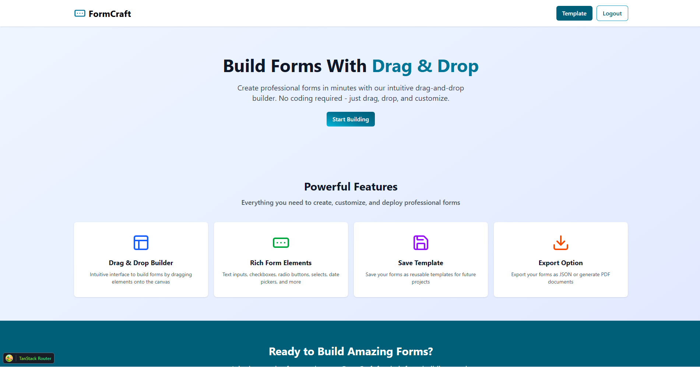

# 📝 Form Builder App

A **Form Builder Application** built with **React** that allows users to drag & drop UI elements to create dynamic forms.  
The app provides a **real-time preview**, a **properties panel** for customization, and the ability to **save, edit, and export templates**.  
It also supports **authentication with Firebase**, ensuring personalized form management.

---

## 🚀 Features

- 🔹 **Drag & Drop Builder** — Build forms visually using `@dnd-kit`.
- 🔹 **Customizable Elements** — Input, Textarea, Checkbox, Radio, Select, Date, Email, Button.
- 🔹 **Properties Panel** — Edit label, name, placeholder, required state.
- 🔹 **Element Options** — Add, edit, delete options for Select/Radio/Checkbox.
- 🔹 **Template Management** — Save forms as templates, edit, search, and delete.
- 🔹 **Authentication** — Login/Signup with Firebase Auth.
- 🔹 **Export Options** — Download forms as JSON or PDF.
- 🔹 **Preview Mode** — Toggle between preview and properties panel.

---

## 📋 Project Tasks

### ✅ Completed

- Routing setup with `@tanstack/react-router`.
- Landing page with feature preview & start building.
- Drag & drop builder using `@dnd-kit`.
- Element panel with draggable UI components.
- Properties panel for element customization.
- Element option management (Add/Edit/Delete).
- State management with `zustand`.
- Authentication pages (login/signup) with validation.
- Firebase app & analytics setup.
- Templates page (static demo).

### 🔄 Planned / In Progress

- Bind Firebase Auth (register/signin/signout).
- Save & load templates from database.
- Open existing templates for editing.
- Export templates as JSON & PDF.
- Search functionality in templates page.
- Preview/Properties toggle mode.
- Clear canvas with confirmation.

---

## 📸 Screenshots



---

## 🛠️ Tech Stack

- **React** + **TypeScript**
- **@tanstack/react-router** — Routing
- **@dnd-kit** — Drag & drop
- **zustand** — State management
- **react-hook-form** + **zod** — Forms & validation
- **Firebase** — Authentication & Analytics
- **TailwindCSS** — Styling

---

## 📦 Installation

```bash
# Clone repository
git clone https://github.com/mandouro-22/form-builder.git

# Navigate to project
cd form-builder

# Install dependencies
npm install

# Start development server
npm run dev
```
